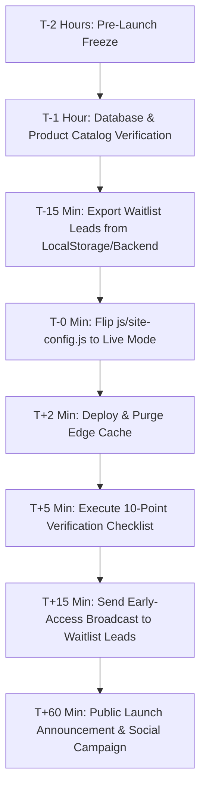

# MISS REZANNA — Winter 2026 Launch Day Playbook (`LAUNCH.md`)

This playbook is the single operational guide for launching the MISS REZANNA Winter 2026 collection. It details the exact sequence of actions, the one-switch configuration change, rollback safeguards, product upload guidelines, and a 10-point post-launch verification checklist.

---

## 1. Launch Overview & Team Roles

- **Scheduled Launch Date**: October 15, 2026
- **Launch Target Time**: 00:00:00 IST (Countdown expires)
- **Timezone**: Indian Standard Time (`Asia/Kolkata`, UTC+5:30)
- **Primary Domain**: [missrezanna.com](https://www.missrezanna.com)
- **Target Git Branch**: `main` (merged from `winter-launch-update`)

### Launch Team & Responsibilities

| Role | Person | Responsibilities |
|---|---|---|
| **Store Owner** | Brand Owner / Management | Final collection approval, pricing confirmation, stock availability, VIP early-access WhatsApp broadcast. |
| **Tech Lead / Developer** | Antigravity / Eng Lead | Flip `js/site-config.js`, verify Vercel/Railway static deployments, run 10-point checklist, handle technical rollback if needed. |
| **Marketing & Analytics** | Gautam (or Media Agency) | GTM verification (`GTM-KPMHRF2M`), Meta Ads campaign activation, Google Ads conversion check, VIP lead export notification. |

---

## 2. Launch Day Execution Sequence

Follow these steps in strict chronological order:



### Timeline:

1. **T-2 Hours (22:00 IST, Oct 14)**:
   - Freeze code repository. Ensure no other PRs or uncommitted edits are pending.
   - Verify Razorpay API keys (`RAZORPAY_KEY_ID`, `RAZORPAY_KEY_SECRET`) are in live mode and funded/active.
2. **T-1 Hour (23:00 IST, Oct 14)**:
   - Verify winter products are populated in `js/product.js` (static fallback) and the database (via `/admin.html` or Railway backend).
   - Ensure all product image URLs resolve properly.
3. **T-15 Minutes (23:45 IST, Oct 14)**:
   - Export waitlist signups collected during the teaser phase (`localStorage.getItem('mr_waitlist')` or backend `/api/v1/waitlist`).
   - Deliver waitlist numbers to the WhatsApp business desk (+91 98773 27186) for VIP early access.
4. **T-0 (00:00 IST, Oct 15)**:
   - Flip `js/site-config.js` to live mode (see Section 3).
   - Deploy to production.
5. **T+5 Minutes**:
   - Execute the 10-Point Verification Checklist (Section 6).
6. **T+15 Minutes**:
   - Send early access WhatsApp notification with VIP coupon code to all waitlist subscribers.
7. **T+60 Minutes**:
   - Announce publicly on Instagram (`@miss_rezanna`), Facebook, and run ad campaigns.

---

## 3. How to Flip from Teaser Mode to Live Mode

The entire storefront transitions between **Teaser Mode** and **Live Mode** using a single configuration file: `js/site-config.js`.

### Step 1: Open `js/site-config.js`

Locate lines 8–18 in `js/site-config.js`:

```javascript
window.MISS_REZANNA_CONFIG = {
  // Master switch for the Winter Launch Teaser
  // Set to TRUE during pre-launch (Oct 1 - Oct 14)
  // Set to FALSE on Launch Day (Oct 15, 2026) to restore full storefront
  TEASER_MODE: true,

  // Global out-of-stock lock for all items
  // Set to TRUE during teaser mode
  // Set to FALSE on Launch Day to re-enable Add to Bag and Checkout
  ALL_PRODUCTS_OUT_OF_STOCK: true,
```

### Step 2: Change Values to `false`

Change `TEASER_MODE` and `ALL_PRODUCTS_OUT_OF_STOCK` from `true` to `false`:

```javascript
window.MISS_REZANNA_CONFIG = {
  // Master switch for the Winter Launch Teaser
  TEASER_MODE: false,

  // Global out-of-stock lock for all items
  ALL_PRODUCTS_OUT_OF_STOCK: false,
```

### Step 3: Synchronize & Deploy

If you are using git-based deployments (e.g. Vercel or Railway):

```bash
git add js/site-config.js public/js/site-config.js backend/src/public/js/site-config.js
git commit -m "chore(launch): flip site-config to live mode for Winter 2026 launch"
git push origin main
```

*(Note: If changes are copied manually to the hosting server, ensure `public/js/site-config.js` and `backend/src/public/js/site-config.js` receive the exact same update.)*

### Step 4: Verify the Switch

1. Open an Incognito/Private window (to avoid local browser cache).
2. Visit `https://www.missrezanna.com/`:
   - The top teaser announcement bar is gone.
   - The Teaser Hero & Countdown are replaced by the brand hero and catalog sections.
   - Collections, New Arrivals, Fabric banner, and Our Story sections are fully visible.
3. Visit `https://www.missrezanna.com/collection.html`:
   - "Out of Stock" badges are removed from in-stock winter items.
   - Product cards display active "View Product" or "Add to Bag" buttons.
4. Visit `https://www.missrezanna.com/product.html?id=...`:
   - "Out of stock. Back soon." notice is replaced by normal size selectors and active "Add to Bag" / "Buy it Now" buttons.

---

## 4. Rollback Procedure (< 2 Minutes)

If a critical issue occurs post-launch (e.g. payment gateway outage, inventory sync failure, or accidental launch):

1. **Re-open `js/site-config.js`**
2. Change both flags back to `true`:
   ```javascript
   TEASER_MODE: true,
   ALL_PRODUCTS_OUT_OF_STOCK: true,
   ```
3. Commit and push immediately:
   ```bash
   git commit -am "hotfix(rollback): revert to teaser mode"
   git push origin main
   ```
4. Within 60–90 seconds of Vercel/Railway build completion:
   - The site immediately re-enters teaser mode.
   - All Add to Bag and Checkout actions are disabled across desktop and mobile.
   - Direct backend order creation is locked by server middleware.

---

## 5. Winter Product Catalog Template

When adding new winter garments to `missrezanna.com`, use the following schemas.

### A. Static Catalog Format (`js/product.js`)

Add new entries to the `staticProductCatalog` object in `js/product.js`:

```javascript
'winter-cashmere-embroidered-kurti': {
  name: 'Cashmere Blend Embroidered Kurti Set',
  seoTitle: 'Cashmere Embroidered Kurti Set for Women | MISS REZANNA',
  metaDesc: 'Handcrafted luxury winter cashmere blend kurti set with delicate zardozi embroidery. Sizes S to 6XL. Free shipping across India.',
  price: '₹ 5,800',
  label: 'Winter 2026 Edit · Wool Blend',
  inStock: true,
  images: [
    'images/winter-cashmere-1.jpg',
    'images/winter-cashmere-2.jpg',
    'images/winter-cashmere-3.jpg',
    'images/winter-cashmere-4.jpg'
  ],
  description: `
    <p style="font-size: 1.05rem; font-style: italic; color: #b89728; margin-bottom: 12px;">Warmth meets timeless Indian heritage.</p>
    <p style="margin-bottom: 16px; font-weight: 500; line-height: 1.6;">A luxurious winter ensemble crafted from an ultra-soft cashmere-wool blend, finished with signature hand-guided embroidery along the cuffs and neckline.</p>
    <h4 style="font-family: 'Playfair Display', serif; font-size: 1.15rem; margin: 20px 0 10px; color: #111;">Artisanal Winter Luxury</h4>
    <p style="margin-bottom: 12px;">Engineered for cold-weather elegance without bulk. Paired with tailored thermal-lined cigarette trousers for maximum comfort.</p>
  `,
  variants: [
    { size: 'S', inStock: true },
    { size: 'M', inStock: true },
    { size: 'L', inStock: true },
    { size: 'XL', inStock: true },
    { size: '2XL', inStock: true },
    { size: '3XL', inStock: true },
    { size: '4XL', inStock: true },
    { size: '5XL', inStock: true },
    { size: '6XL', inStock: true }
  ]
}
```

### B. Image Asset Standards

| Specification | Requirement | Rationale |
|---|---|---|
| **Aspect Ratio** | 3:4 (e.g. 1200 x 1600 px) | Preserves consistent grid cards across all devices |
| **Format** | WebP (preferred) or progressive JPEG | Fast mobile loading across 4G/5G Indian networks |
| **Max File Size** | < 250 KB per image | Prevents LCP (Largest Contentful Paint) regressions |
| **Background** | Clean studio neutral / warm cream (`#FBF9F5`) | Matches MISS REZANNA luxury aesthetic |
| **Alt Text** | Descriptive, e.g. "Cashmere embroidered kurti front detail" | Mandatory for Google Merchant & SEO accessibility |

### C. Required vs Optional Fields

| Field | Type | Status | Note |
|---|---|---|---|
| `id` / `slug` | String | **Mandatory** | URL slug, lowercase alphanumeric with hyphens |
| `name` | String | **Mandatory** | Display product name |
| `price` | String | **Mandatory** | Formatted with Indian Rupee symbol: `₹ X,XXX` |
| `images` | Array | **Mandatory** | Minimum 2 images, maximum 6 images |
| `inStock` | Boolean | **Mandatory** | `true` if available for purchase |
| `label` | String | Optional | Collection tag badge (e.g. "Winter Edit") |
| `description` | HTML String | **Mandatory** | Detailed garment story & fabric notes |
| `variants` | Array | **Mandatory** | S through 6XL availability |

---

## 6. Post-Launch 10-Point Verification Checklist

Run through this checklist within 10 minutes of flipping to live mode:

- [ ] **1. Homepage Hero Check**: Verify the teaser countdown has been replaced by the live brand banner.
- [ ] **2. Navigation Links**: Click every navbar link (Home, Collection, About, Journal, Exhibitions, Contact) — no 404s or `#`.
- [ ] **3. Collection Grid**: Verify winter collection cards load with correct imagery, titles, and formatted Rupee prices.
- [ ] **4. Product Page (PDP)**: Navigate to a product page (`product.html?id=...`). Ensure size buttons (S–6XL) are clickable and active.
- [ ] **5. Add to Bag**: Click "Add to Bag". Confirm item is added to cart counter and slide-out / redirect works.
- [ ] **6. Cart Checkout**: Open `cart.html`. Confirm "All items out of stock" warning is gone, price total calculates correctly, and "Proceed to Checkout" is enabled.
- [ ] **7. Payment Gateway**: Click checkout and verify the Razorpay modal initializes with order ID and amount in INR.
- [ ] **8. Mobile Viewport (390px)**: Test on an iPhone/Android screen. Ensure no horizontal scrolling or clipped buttons.
- [ ] **9. WhatsApp Concierge**: Tap the WhatsApp button (+91 98773 27186) to confirm it opens chat with pre-filled enquiry text.
- [ ] **10. Analytics & GTM**: Check GTM Preview mode to confirm `view_item`, `add_to_cart`, and `begin_checkout` events trigger.

---

## 7. GTM Setup & Analytics Reference for Gautam

The website data layer is configured with the following custom events for Google Tag Manager (`GTM-KPMHRF2M`):

### 1. Waitlist Leads (`waitlist_signup` & `generate_lead`)
Triggered when a customer submits the winter teaser form:
```javascript
dataLayer.push({
  event: 'waitlist_signup',
  form_name: 'winter_2026_waitlist',
  lead_type: 'vip_winter_teaser',
  lead_phone: '+91XXXXXXXXXX',
  timestamp: new Date().toISOString()
});
```
*GTM Setup*: Create a Custom Event Trigger for `waitlist_signup` and map to:
- GA4 Event: `generate_lead`
- Meta Pixel: `Lead` event (send hashed phone if advanced matching is enabled).

### 2. View Item (`view_item`)
Triggered on PDP load (`product.html`):
```javascript
dataLayer.push({
  event: 'view_item',
  ecommerce: {
    currency: 'INR',
    value: 4500,
    items: [{
      item_id: 'navy-blue-embroidered-kurta-pant-set',
      item_name: 'Navy Blue Floral Embroidered Kurta Pant Set',
      item_category: 'Kurta Pant Sets',
      price: 4500,
      quantity: 1
    }]
  }
});
```

### 3. Add to Bag (`add_to_cart`)
Triggered when an in-stock item is added to the bag:
```javascript
dataLayer.push({
  event: 'add_to_cart',
  ecommerce: {
    currency: 'INR',
    value: 4500,
    items: [{
      item_id: '...',
      item_name: '...',
      price: 4500,
      item_variant: 'M',
      quantity: 1
    }]
  }
});
```

---

*Playbook prepared by Antigravity AI Engineering. Keep strictly confidential until official public announcement.*
